# PRIMER EXÁMEN PRÁCTICO | TÉCNICAS DE INTELIGENCIA ARTIFICIAL
## IMPLEMENTANDO JUEGO TIMBIRICHE
### Damián Elí García Corte 201750579

### IMPLEMENTACIÓN
Este es el examen práctico de la materia de Técnicas de Inteligencia Artificial donde se tiene que implementar el juego Timbiriche o Dots and Boxes. El programa está implementado en el lenguaje de programación Python y contiene comentarios para su mejor entendimiento.
La implementación sigue lo propuesto en el examen teórico previamente entregado y aceptado por el profesor. A continuación, se presentan las capturas de pantalla del funcionamiento de este programa. Antes de presentar las capturas, debido a la buena implementación de las funciones de Costo es muy dificil hacer algún punto, pero es posible, solo se tiene que pensar bien el cómo hacerlo.

### CAPTURAS DE PANTALLA
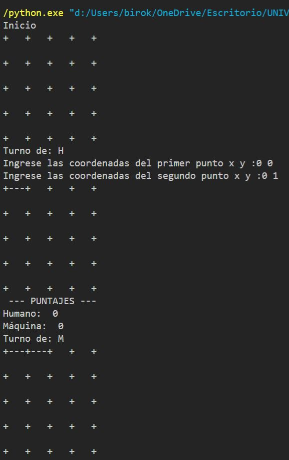
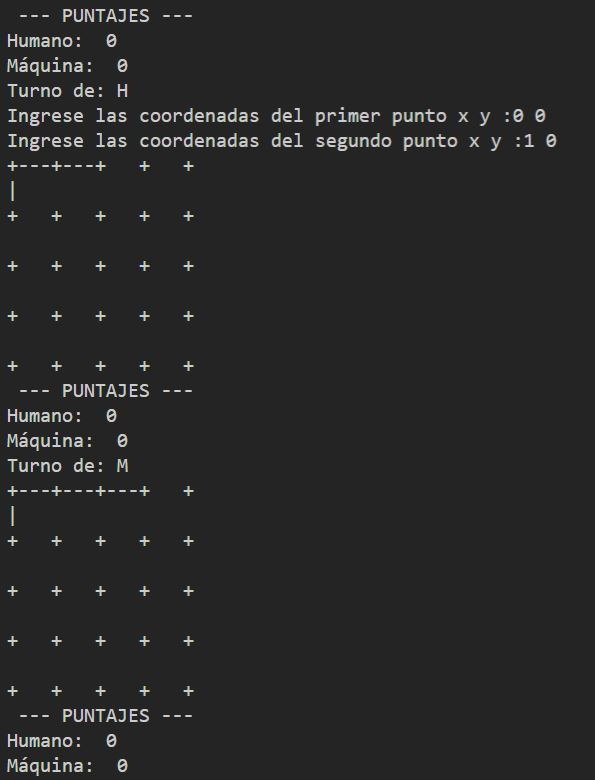
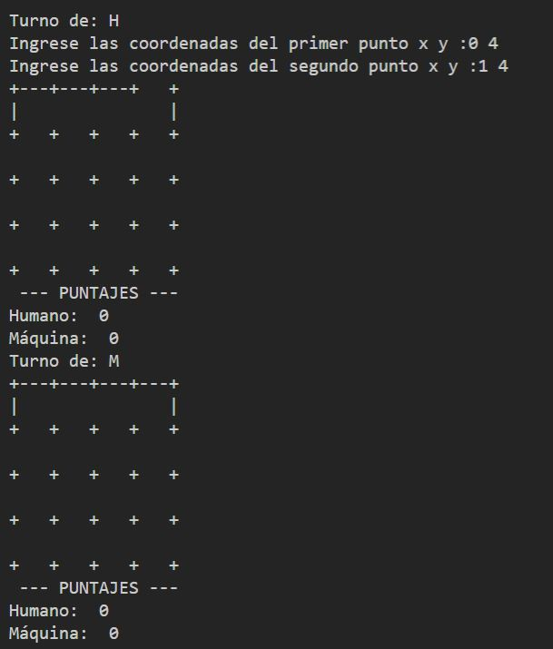
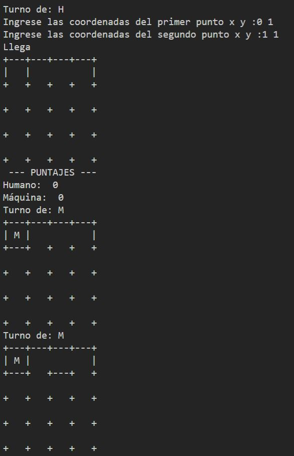
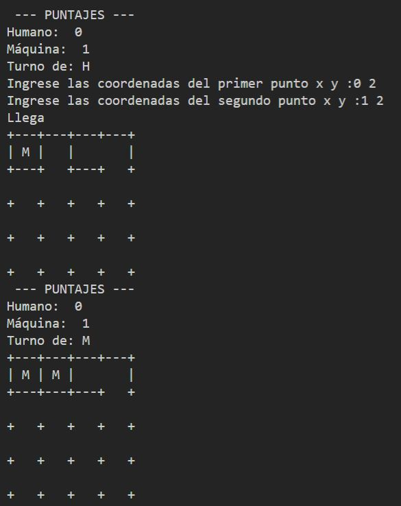
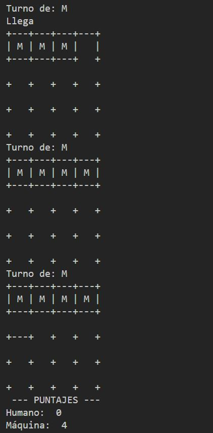
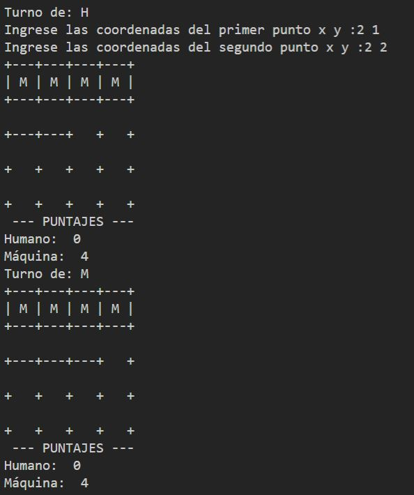
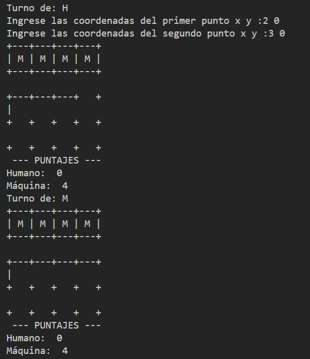
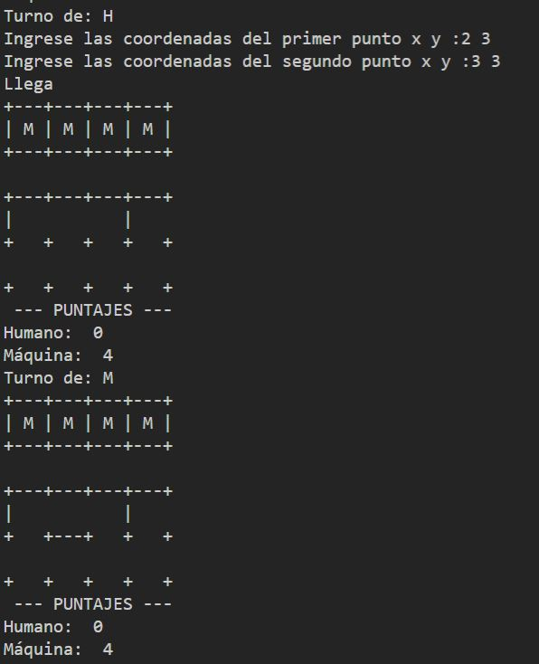
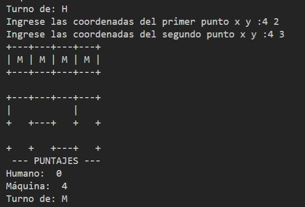

Después de tantos movimientos llegamos al fin del juego, a continuación se muestra la salida de pantalla.
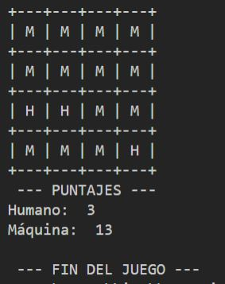
